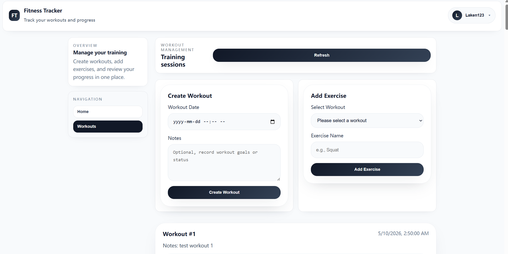
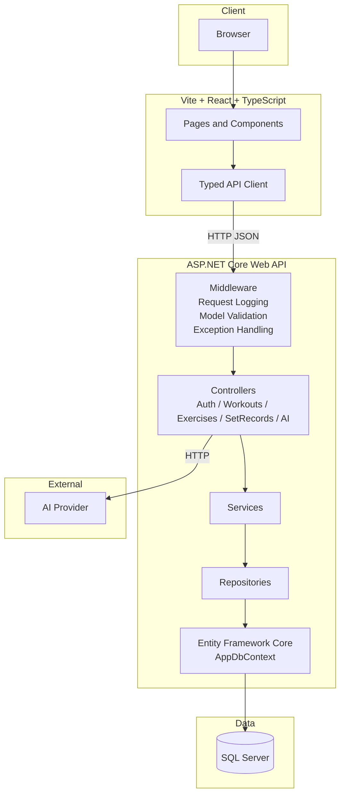
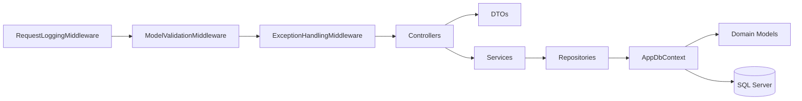
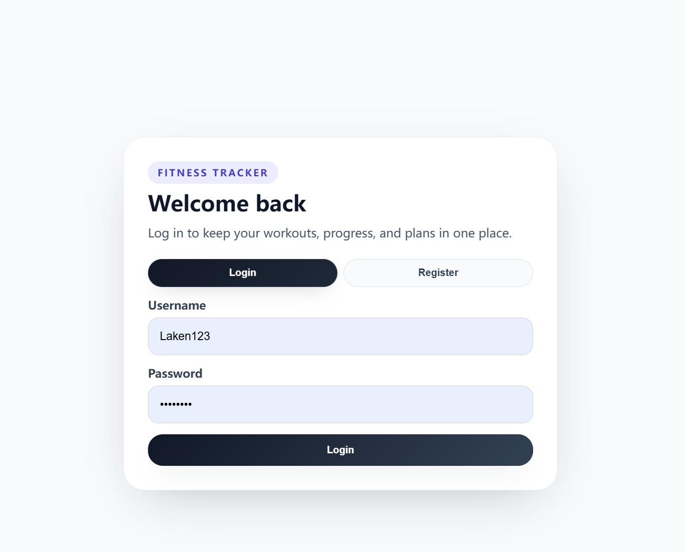
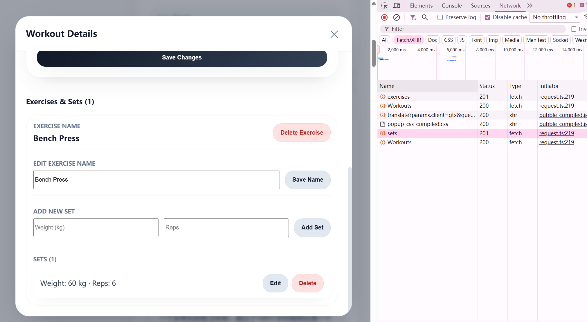
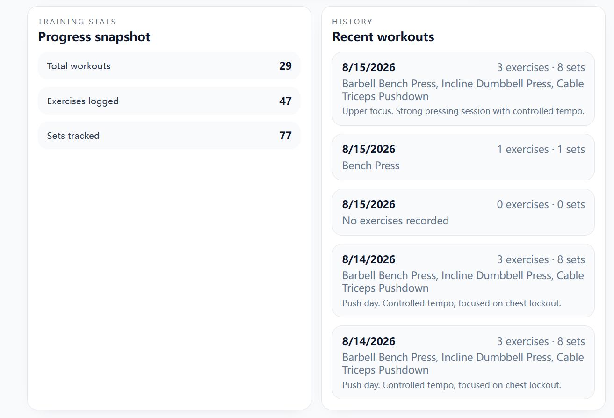
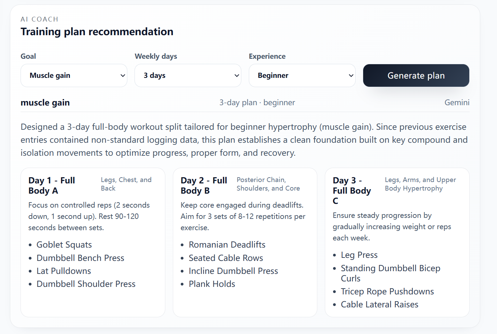
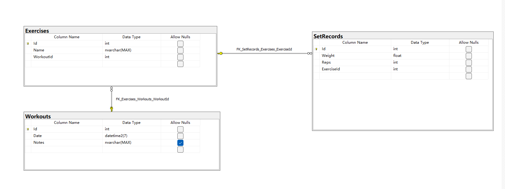
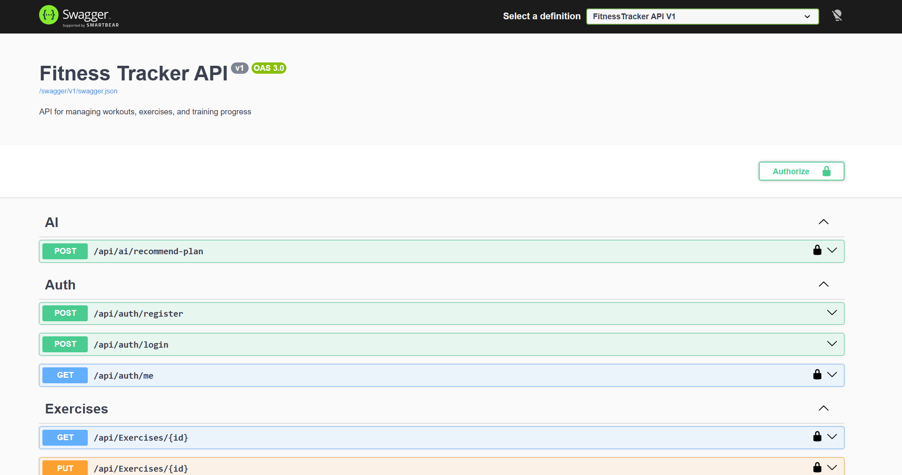
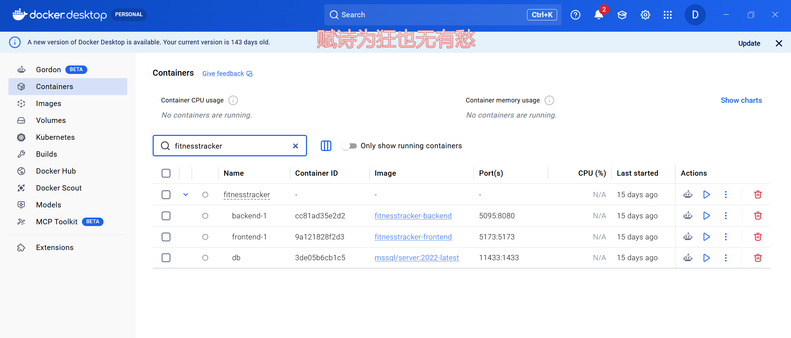

# FitnessTracker

## Project Overview

A full-stack fitness tracking system built with ASP.NET Core + React + TypeScript + SQL Server.



## Tech Stack

**Backend:** ASP.NET Core · Entity Framework Core · SQL Server

**Frontend:** React · TypeScript · Vite · Sass

**API:** REST · Swagger · OpenAPI

**Infrastructure:** Docker · Docker Compose

## What I Built

- Implemented layered backend architecture
- Built JWT authentication
- Designed workout, exercise, and set APIs
- Added request logging and exception handling
- Generated typed frontend API clients from OpenAPI
- Containerized the application with Docker Compose

## Architecture

### 1) Container Architecture



This view shows deployment-level responsibilities and communication paths between frontend, backend, data, and external services.

### 2) Backend Component Flow



Request lifecycle:

1. Middleware handles cross-cutting concerns first (logging, validation, exception normalization).
2. Controllers map HTTP requests to use cases and convert payloads with DTOs.
3. Services implement business rules and orchestration.
4. Repositories and EF Core handle persistence and querying.

### Why This Architecture Works

- Separation of concerns keeps business logic independent from transport and storage details.
- Middleware centralizes cross-cutting behavior, reducing duplication.
- DTO-based contracts and OpenAPI-driven clients improve frontend-backend consistency.
- Layered design simplifies testing, maintenance, and future feature expansion.

## Core Features

### Authentication



- User registration
- User login
- JWT authentication
- Protected routes

### Workout Management



- Create workouts
- Manage exercises
- Record sets
- Edit and delete workout data

### Training Statistics



- Training history
- Workout statistics
- Progress tracking

### AI Coach



- Generate personalized training recommendations
- Select goal, experience level, training days, and available equipment
- View structured plans directly in the app

## Engineering Highlights

### Layered Architecture

Controller → Service → Repository

### Middleware

Centralized request logging, model validation, and exception handling through custom ASP.NET Core middleware.

### Type-safe API Integration

Used OpenAPI code generation to generate typed API clients
for frontend-backend communication.

### Authentication

Implemented JWT-based authentication and protected API endpoints.

### Docker

Used Docker Compose to provide a reproducible full-stack
development environment.

## Screenshots







## Quick Start

Choose one of the following startup modes.

### Option 1: Docker Compose (Recommended)

Start all services (SQL Server, API, UI):

```bash
docker compose up -d --build
```

Open:

- Frontend: http://localhost:5173
- Backend API: http://localhost:5095
- Swagger: http://localhost:5095/swagger

Stop services:

```bash
docker compose down
```

### Option 2: Local Development (Fast Iteration)

#### Prerequisites

- .NET 10 SDK
- Node.js 20+
- Docker (for local SQL Server)

#### 1) Start database only

```bash
docker compose up -d db
```

#### 2) Start backend API

```bash
cd backend/FitnessTrackerAPI/FitnessTrackerAPI
dotnet restore
dotnet run
```

#### 3) Start frontend

```bash
cd frontend/fitness-tracker-ui
npm install
npm run dev
```

Open:

- Frontend: http://localhost:5173
- Backend API: http://localhost:5095
- Swagger: http://localhost:5095/swagger

## API

| Method | Endpoint             | Description    |
| ------ | -------------------- | -------------- |
| POST   | `/api/auth/register` | Register       |
| POST   | `/api/auth/login`    | Login          |
| GET    | `/api/workouts`      | Get workouts   |
| POST   | `/api/workouts`      | Create workout |
